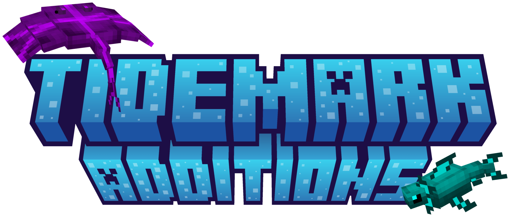
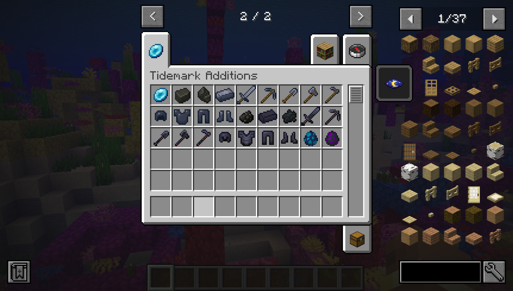
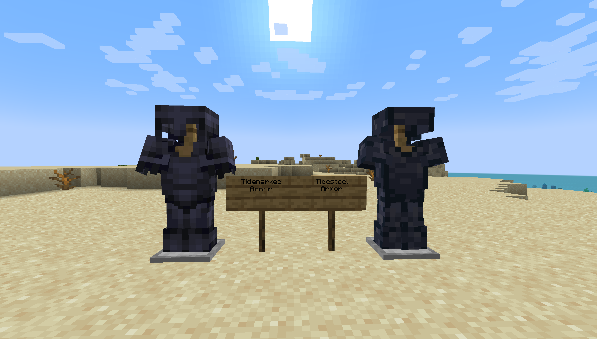
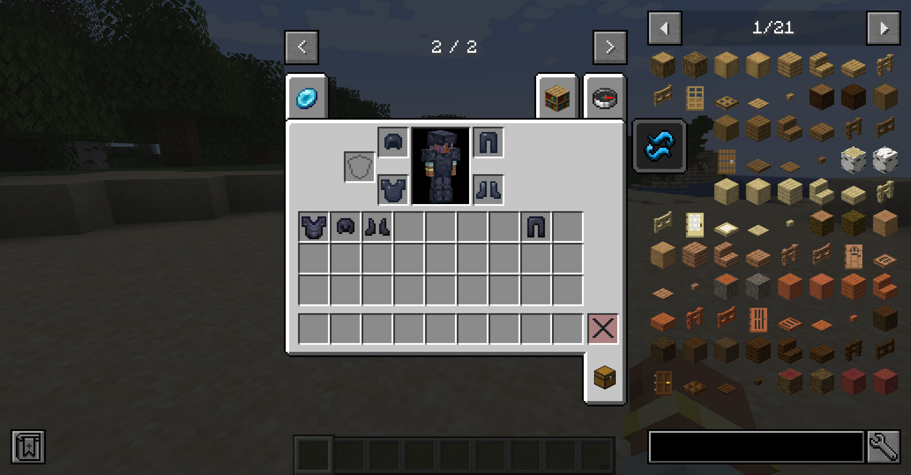
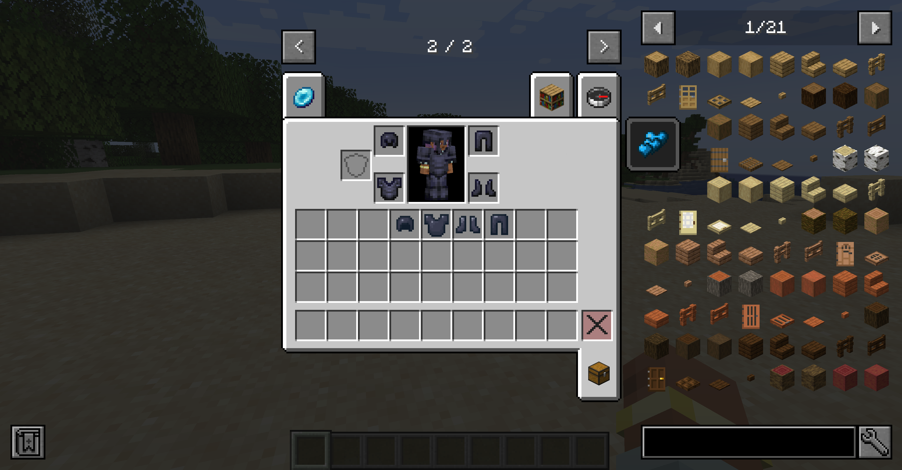

A Minecraft Mod that adds ocean content: new gear, materials, mobs, loot, and progression.

# Dependencies

## Required

- Geckolib

## Optional

- JEI

# Features

## Mobs

### Tidefin

Spawns in ocean biomes. Drops Tidescales, used to craft Tidesteel and Tidemarked Armor.

### Abyssal Ray

Spawns in deep ocean biomes. Drops Abyssal Hides, used to craft Tidemarked Armor.

## New Items & Resources

### Items

- tidescale — dropped by Tidefin.
- abyssal hide — dropped by Abyssal Ray.
- driftsteel fragment — found in shipwrecks and underwater ruins.
- driftsteel — crafted with driftsteel fragments.
- tidesteel ingot — crafted with tidescale and driftsteel.
- tidemarked ingot — ingot crafted with an abyssal hide, driftsteel, tidescale, and resonant scale.
- resonant scale — dropped as Warden loot.

### Tools & Weapons

- Tidesteel toolset: Slightly better than diamond gear, with higher durability and echantability.

- Tidemarked toolset: Slightly worse than netherite gear, with higher durability and echantability.

### Armor

- Tidesteel armor: Slightly better than diamond gear, with higher durability and echantability. Equipping the whole set
  gives the player the Undertide effect.
- Tidemarked armor: Slightly worse than netherite gear, with higher durability and echantability. Equipping the whole set
  gives the player the Tidemarked effect.

## Effects

### Undertide

Equipping the full Tidesteel armor set grants the Undertide effect, which gives:

- Water Breathing when submerged.
- increases movement speed in water by 30%.
- Immunity to the Darkness Effect.
- Haste when submerged

### Tidemarked

- Equipping the full Tidemarked armor set grants the Tidemarked effect which:
  - Regenerates a heart every 3s when in water after staying still for 3s.

